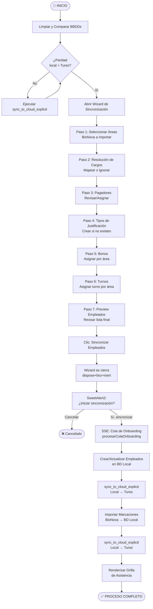

# Flujo Completo de Sincronización BioAlba

**Fecha:** 18 de Mayo de 2026  
**Versión:** 1.0  
**Tipo:** Referencia Operativa (no es un ADR — ver `adr_004` para decisiones de negocio)

---

## Propósito

Documentar la secuencia completa y verificada del proceso de sincronización de empleados y marcaciones en el sistema BioAlba, desde el estado limpio de base de datos hasta el registro de asistencia final. Este documento es la fuente de verdad para QA, onboarding y mantenimiento del módulo.

---

## Diagrama de Flujo General



---

## Secuencia Detallada

### FASE 0 — Preparación (Herramienta de Desarrollo)

> **Script:** `scripts/limpiar_y_comparar.py`  
> **Cuándo usarlo:** Solo en entorno de desarrollo/QA para resetear el estado de la BD.

| Paso | Acción | Detalle |
|------|--------|---------|
| 0.1 | Ejecutar script | `python scripts/limpiar_y_comparar.py` |
| 0.2 | Seleccionar opción | `5` = Limpiar TODA la base de datos |
| 0.3 | Limpieza local | DELETE en SQLite local (tablas de catálogos + datos transaccionales) |
| 0.4 | Propagación cloud | `sync_to_cloud_explicit()` empuja el WAL local → Turso |
| 0.5 | Verificación paridad | El script compara conteos local vs Turso; debe mostrar `✅ PARIDAD TOTAL` |

> ⚠️ **Regla crítica:** Las limpiezas se hacen SOLO en local, nunca directamente en Turso. Cualquier DELETE directo en Turso rompe el historial WAL y causa `Generation ID mismatch`.

---

### FASE 1 — Wizard: Paso 1 — Selección de Áreas

| Paso | Actor | Acción |
|------|-------|--------|
| 1.1 | Usuario | Clic en botón **"Sincronizar Empleados"** (navbar o dashboard) |
| 1.2 | Frontend | Abre `#modal-sync-wizard` vía `new bootstrap.Modal(el, {backdrop:'static'})` |
| 1.3 | Backend | `GET /api/sync/wizard/areas/` → devuelve lista de áreas detectadas en BioNova |
| 1.4 | Usuario | Selecciona una o más áreas (checkboxes) |
| 1.5 | Estado | `window._wizardState.areasSeleccionadas[]` se actualiza |

---

### FASE 2 — Wizard: Paso 2 — Resolución de Cargos

| Paso | Actor | Acción |
|------|-------|--------|
| 2.1 | Backend | `POST /api/sync/wizard/cargos/` con `{areas: [...]}` → devuelve cargos únicos detectados |
| 2.2 | UI | Muestra dropdown por cargo: mapear a cargo existente / crear nuevo / ignorar |
| 2.3 | Usuario | Define resolución para cada cargo |
| 2.4 | Estado | `window._wizardState.resoluciones.cargos{}` guarda `{cargo: id | "_IGNORE_"}` |

> 📝 Los cargos ignorados (`_IGNORE_`) excluirán a sus empleados del paso de Preview.

---

### FASE 3 — Wizard: Paso 3 — Pagadores

| Paso | Actor | Acción |
|------|-------|--------|
| 3.1 | Backend | `GET /api/sync/wizard/pagadores/` → devuelve pagadores activos |
| 3.2 | Usuario | Revisa o asigna pagadores por área si se requiere |
| 3.3 | Sub-modal | Si el usuario crea un pagador nuevo, se abre `_wizardOpenChildModal('modal-gestion-pagadores', ...)` |
| 3.4 | Patrón de cierre | Wizard se oculta con `dispose()+inert` → sub-modal se abre → al cerrar sub-modal, `_wizardRestoreAfterChild()` quita `inert` y re-muestra el wizard |

---

### FASE 4 — Wizard: Paso 4 — Tipos de Justificación

| Paso | Actor | Acción |
|------|-------|--------|
| 4.1 | Backend | `GET /api/configuracion/justificaciones/tipos/` |
| 4.2 | UI | Si existen tipos → muestra lista. Si no existen → muestra panel de creación |
| 4.3 | Sub-modal | Clic "Crear Tipo" abre `_wizardOpenChildModal('modal-tipo-justificacion', ...)` |

---

### FASE 5 — Wizard: Paso 5 — Bonos

| Paso | Actor | Acción |
|------|-------|--------|
| 5.1 | Backend | `POST /api/sync/wizard/bonos/` con `{areas: [...]}` |
| 5.2 | UI | Muestra checkboxes de bonos por área |
| 5.3 | Sub-modal | Si no hay bonos, panel guía → `_wizardOpenChildModal` con modal de creación de bono |
| 5.4 | Estado | `window._wizardState.resoluciones.bonos{}` guarda `{area: [id, id, ...]}` |

---

### FASE 6 — Wizard: Paso 6 — Turnos

| Paso | Actor | Acción |
|------|-------|--------|
| 6.1 | Backend | `POST /api/sync/wizard/turnos/` con `{areas: [...]}` |
| 6.2 | UI | Muestra dropdown de turno por área (pre-selecciona el turno default si existe) |
| 6.3 | Sin turnos | Si `turnosDisponibles.length === 0` → panel de alerta + botón "Ir a Crear Turno" |
| 6.4 | Crear turno | `window._wizardIrACrearTurno()` → usa `dispose()+inert` en wizard → navega a Configuración → abre `modalTurno` |
| 6.5 | Retorno | Al cerrar `modalTurno`, quita `inert` del wizard y lo re-muestra en el paso 6 |
| 6.6 | Estado | `window._wizardState.resoluciones.turnos{}` guarda `{area: turno_id}` |

---

### FASE 7 — Wizard: Paso 7 — Preview y Confirmación

| Paso | Actor | Acción |
|------|-------|--------|
| 7.1 | Backend | `POST /api/sync/empleados/preview/` con `{areas, ignored_cargos}` |
| 7.2 | UI | Tabla con RUT / Nombre / Área / Estado — todos pre-seleccionados |
| 7.3 | Usuario | Puede desmarcar empleados individualmente o usar filtros |
| 7.4 | Usuario | Clic **"Sincronizar Empleados"** |

#### Secuencia al presionar "Sincronizar Empleados"

```
Usuario clic "Sincronizar Empleados"
    │
    ▼
confirmWizardSync()
    │
    ├─ Recolectar RUTs marcados (.wiz-chk-emp:checked)
    │
    ├─ CERRAR WIZARD (dispose + blur + display:none)
    │    └── Eliminar backdrop + restaurar body
    │
    ├─ Swal.fire("¿Iniciar sincronización?")   ← aparece limpio, sin backdrop del wizard
    │
    ├─ Si Cancelar → FIN
    │
    └─ Si Confirmar →
         setTimeout(300ms) → _executeSyncFromWizard(payload)
```

---

### FASE 8 — Sincronización via SSE

| Paso | Actor | Acción |
|------|-------|--------|
| 8.1 | Frontend | `_executeSyncFromWizard(payload)` construye `EventSource` → `GET /api/sync/onboarding/sse/` |
| 8.2 | Backend | Inicia `procesarColaOnboarding`: itera áreas/empleados en cola |
| 8.3 | SSE Events | `{event: "empleado_procesado", data: {rut, nombre, status}}` por cada empleado |
| 8.4 | SSE Events | `{event: "progreso", data: {actual, total, porcentaje}}` |
| 8.5 | SSE Events | `{event: "finalizado", data: {exitosos, fallidos}}` |
| 8.6 | Frontend | Al `finalizado` → cierra `EventSource` → dispara importación de marcaciones |

---

### FASE 9 — Importación de Marcaciones

| Paso | Actor | Acción |
|------|-------|--------|
| 9.1 | Frontend | `POST /api/sync/marcaciones/` con `{areas, ruts, fecha_desde, fecha_hasta}` |
| 9.2 | Backend | Conecta con BioNova → descarga registros de marcación por empleado/área |
| 9.3 | BD | Inserta en tabla `marcaciones` local (SQLite) |
| 9.4 | Sync | `sync_to_cloud_explicit()` → propaga a Turso |
| 9.5 | Frontend | Renderiza grilla de asistencia actualizada |

---

## Arquitectura de Sincronización de BD (Local ↔ Turso)

```
┌──────────────────┐     WAL (libsql embedded)     ┌──────────────────┐
│  SQLite LOCAL    │ ──── sync_to_cloud_explicit ──► │  Turso (Cloud)   │
│  (fuente verdad) │                                 │  (réplica)       │
└──────────────────┘                                 └──────────────────┘

Regla de oro:
  - WRITE  → siempre en Local
  - READ   → puede ser Local (más rápido) o Turso (acceso remoto)
  - SYNC   → Local → Turso via sync_to_cloud_explicit()
  - NUNCA  → escribir directamente en Turso (rompe Generation ID del WAL)
```

---

## Patrón de Cierre Seguro de Modales (Anti-aria-hidden)

El warning **"Blocked aria-hidden on an element because its descendant retained focus"** se evita con el siguiente patrón en todos los cierres de modales del wizard:

```javascript
// ✅ PATRÓN CORRECTO — dispose + blur + inert
modalInstance.dispose();                    // 1. Mata el FocusTrap de Bootstrap
modalEl.querySelectorAll('input,button,[tabindex]').forEach(el => el.blur());
modalEl.blur();
document.body.setAttribute('tabindex','-1');
document.body.focus();
document.body.removeAttribute('tabindex');
modalEl.classList.remove('show');
modalEl.style.display = 'none';
modalEl.setAttribute('inert', '');          // 2. Bloquea CUALQUIER foco futuro

// ❌ PATRÓN INCORRECTO — NO usar:
// modalInstance.hide()
// → Bootstrap pone aria-hidden al FINAL de la animación CSS (fade),
//   cuando FocusTrap ya restauró el foco → warning inevitable
```

---

## Archivos Clave del Módulo

| Archivo | Rol |
|---------|-----|
| `frontend/js/sync_wizard.js` | UI completa del wizard, estado `_wizardState`, SSE client |
| `backend/routers/sync.py` | Endpoints REST del wizard (`/api/sync/wizard/*`) |
| `backend/services/sync_service.py` | Lógica de negocio: onboarding, marcaciones, SSE |
| `backend/core/database.py` | Gestión de conexión libsql, `sync_to_cloud_explicit()` |
| `scripts/limpiar_y_comparar.py` | Herramienta de reset/paridad para desarrollo y QA |

---

## Checklist de Verificación Post-Sync

- [ ] `limpiar_y_comparar.py` muestra `✅ PARIDAD TOTAL` sin diferencias
- [ ] DevTools Console sin errores rojos ni warnings de `aria-hidden`  
- [ ] SweetAlert2 "¿Iniciar sincronización?" aparece sobre fondo gris limpio (sin wizard detrás)
- [ ] SSE emite `finalizado` sin `fallidos > 0`
- [ ] Grilla de asistencia muestra las marcaciones importadas correctamente
- [ ] Turso refleja los mismos registros que SQLite local (verificar con opción `6. Comparar` del script)
